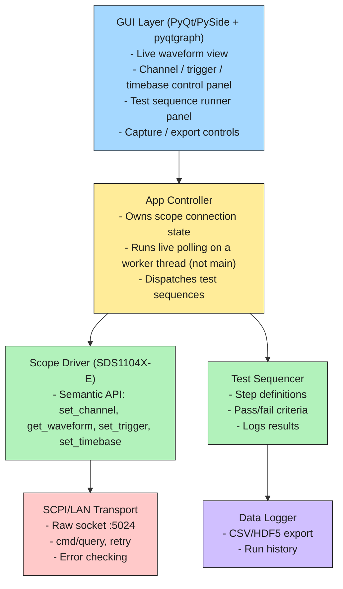

# Oscilloscope-Tool

GUI tool for controlling a Siglent SDS1104X-E oscilloscope over LAN (SCPI).

## Architecture

### Key design calls

1. **Transport is a separate layer from the Scope Driver.** The driver speaks scope semantics (`set_trigger_level(1, 2.5)`); the transport only sends strings / reads responses. This is the layer you swap if USB/VISA gets added later.
2. **Live polling runs on a worker thread.** GUI thread only renders. Network I/O on the main event loop stalls the UI — same problem as a blocking call in an ISR.
3. **Test Sequencer and Data Logger are separate.** Sequencing (what to do) doesn't own persistence (where results go). Sequencer calls the logger, doesn't implement it.

## Status

- [x] Repo scaffolded (`src/` layout, six modules matching the architecture above)
- [x] SCPI/LAN Transport — implemented, verified live against the scope (`*IDN?` round trip working)
- [x] Scope Driver — `identify()`, channel enable/scale/offset/coupling, trigger (level/mode/edge source), timebase, waveform pull, all verified live
- [ ] Test Sequencer
- [x] Data Logger — `save_waveform()` writes captures to gitignored `data/` (CSV/HDF5 export and run history still open)
- [ ] App Controller
- [ ] GUI Layer
